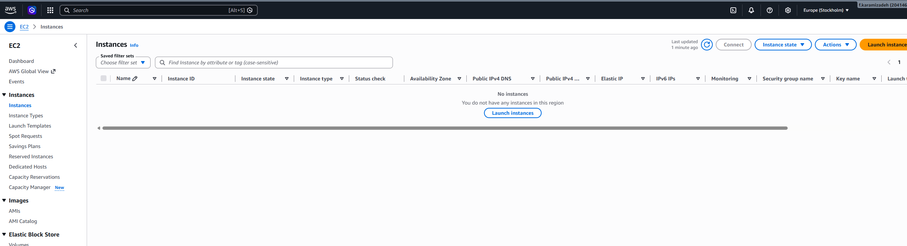
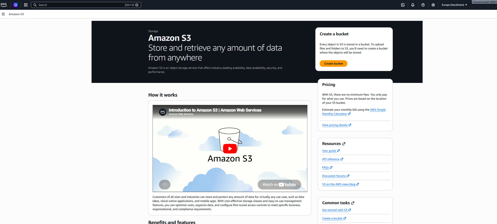
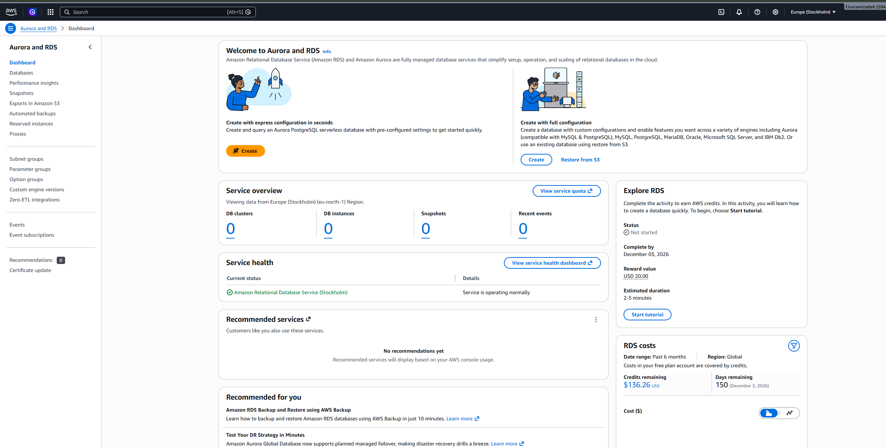
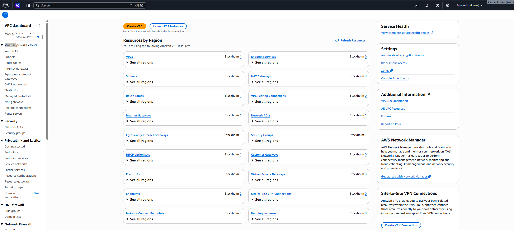
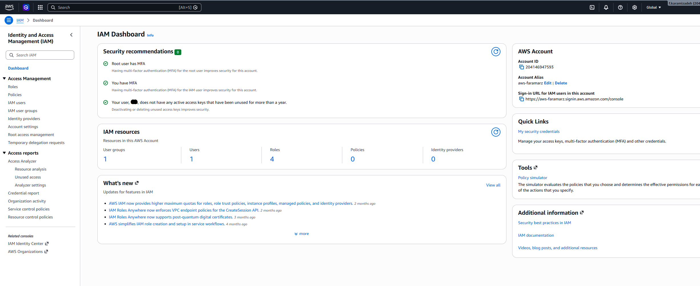
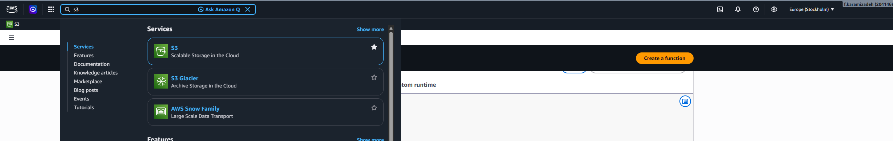
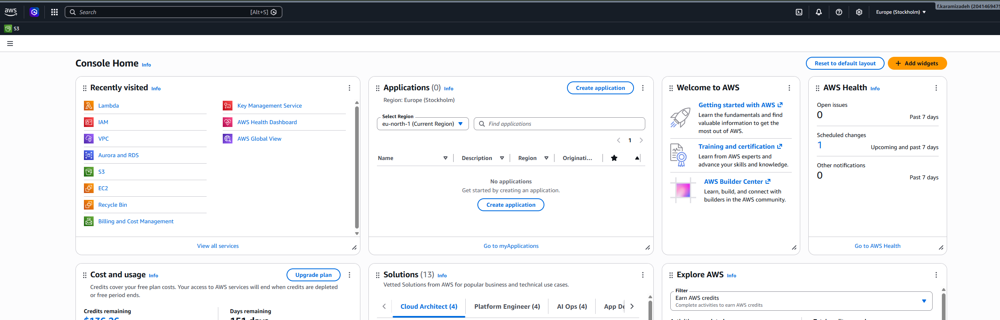
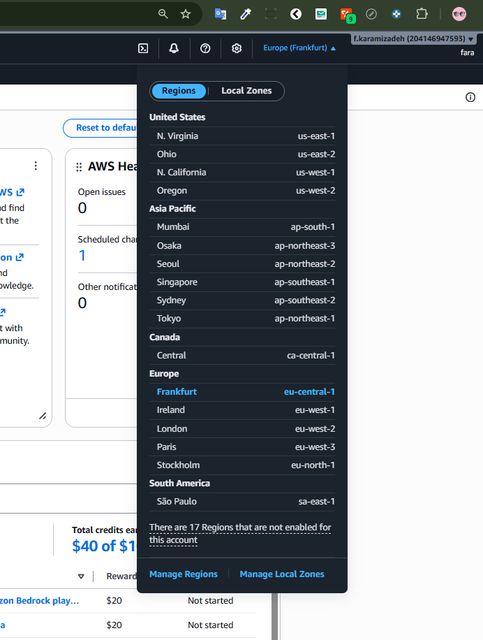
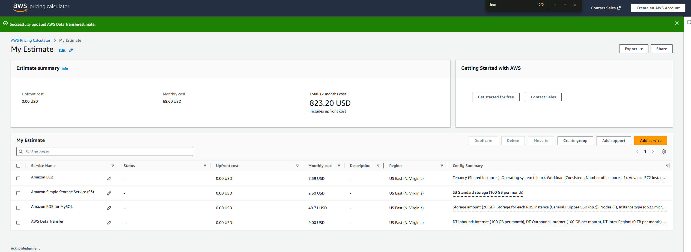

# Exploring AWS Services Lab - Solution

**Student Name:** [Your Name]  
**Date Completed:** [Date]

---

## Exercise 1: Console Navigation

### Part A: Service Discovery

**EC2 (Compute):**

- Purpose: [EC2 Elastic Compute Cloud is a cloud service that lets us rent virtual computers to run our own applications.]
- Screenshot: 

**S3 (Storage):**

- Purpose: [Amazon S3 is a cloud storage service used for saving and retrieving any amount of data, such as backups, media files, and static website assets, anytime from anywhere on the web.]
- Screenshot: 

**RDS (Database):**

- Purpose: [Amazon RDS is a managed cloud service used to easily set up, operate, and scale relational databases like MySQL, PostgreSQL, and SQL Server without the overhead of manual database administration.]
- Screenshot: 

**VPC (Networking):**

- Purpose: [Amazon VPC is a cloud service that lets us isolate a section of the AWS infrastructure to launch our resources in a secure, private virtual network that we control.]
- Screenshot: 

**IAM (Security):**

- Purpose: [AWS IAM is a service that helps us securely manage access to our AWS resources by controlling who is authenticated and authorized to use them.Like user controling.]
- Screenshot: 

### Part B: Console Features

**Lambda Category:** [AWS Lambda belongs to the Compute category, specifically as a Serverless compute service.]

**Pinned Services:**


**Recently Visited:**


**Region Selector:**


- Original region: [Frankfurt]
- Changed to: [Stockholm]
- Changed back: [Yes]

---

## Exercise 2: Service Categorization

### Completed Service Matrix:

| Category   | Services                                            | Primary Use Case             |
| ---------- | -----------------------------------------------------------------------------------|
| Compute    | EC2, Lambda, ECS, EKS, Fargate                      |Running applications          |
| Storage    | S3, EBS, EFS, S3 Glacier                            | Storing data                 |
| Database   | RDS, DynamoDB, Aurora, ElastiCache                  | Managing data                |
| Networking | VPC, Route 53, CloudFront, API Gateway              |  Connecting resources        |
| Security   | IAM, KMS, Cognito, Secrets Manager                  | Securing resources           |
| Management | CloudWatch, CloudTrail, Systems Manager, AWS Config | Monitoring & automation      |


### Research Question Answers:

**1. What's the difference between EC2 and Lambda?**

[EC2 provides us with full control over virtual servers where we manage the operating system, scaling, and runtime environment for continuous workloads, while Lambda is a serverless compute service that automatically runs and scales our code only in response to events, charging us strictly for the milliseconds of execution time without any server management.]

---

**2. When would you use S3 vs EBS?**

[EBS provides low-latency block storage that users attach directly to EC2 instances like a local hard drive, making it perfect for operating systems and active databases. Conversely, S3 offers us highly scalable object storage accessible over the internet, which is ideal for archiving data, hosting static files, and sharing media with millions of users simultaneously.]

---

**3. What's the difference between RDS and DynamoDB?**

[RDS offers us a managed relational database service perfect for structured data, complex joins, and strict ACID compliance like financial records. On the other hand, DynamoDB provides us a serverless, NoSQL database that delivers single-digit millisecond latency at any scale for key-value or document data.]

---

**4. Why do you need a VPC?**

[A VPC provides us an isolated virtual network to securely run AWS resources, control traffic with public and private subnets, and prevent direct internet exposure. It allows us to fully customize networking configurations and securely connect cloud infrastructure to our local data centers.]

---

**5. What does CloudWatch monitor?**

[CloudWatch collects metrics and logs from our AWS resources, allows us to set alarms for automated scaling or notifications, and provides us with centralized dashboards to visualize system performance.]

---

## Exercise 3: AWS CLI

### CLI Version:

```
[aws-cli/2.34.60 Python/3.14.5 Windows/11 exe/ARM64]
```

### Configuration:

```
[NAME       : VALUE                    : TYPE             : LOCATION
profile    : <not set>                : None             : None
access_key : ****************YT44     : shared-credentials-file : 
secret_key : ****************kVnO     : shared-credentials-file : 
region     : eu-north-1               : config-file      : ~/.aws/config]
```

### CLI Outputs:

See attached `cli-outputs.txt` file for all command outputs.

**Key findings:**

- My AWS Account ID: ["204146947593"]
- Default region: [eu-north-1]
- Number of regions available: [17]

---

## Exercise 4: Pricing Research

### Pricing Worksheet:

**1. EC2 t3.micro (Linux, us-east-1):**

- On-Demand: $**0.104** per hour
- Monthly (730 hours): $**7.59**
- Free Tier eligible: [No]
- Free Tier details: [750hours/month free for the first 12 months on a new AWS account]

**2. S3 Standard Storage:**

- 100 GB monthly cost: $**2.30**
- Free Tier: First 5 GB  for 20.000 GET, 2000 PUT free per month for 12 months
- Cost per GB: $**0.0230**

**3. RDS db.t3.micro (MySQL):**

- Monthly cost: $**12.41** instance
- Storage (20 GB): $**2.30**
- Total: $**14.71**
- Free Tier eligible: [Yes] 7 days

**4. Data Transfer OUT:**

- 100 GB cost: $**9.00**
- First 100 GB free per month

### AWS Pricing Calculator Estimate:



**Estimate Link:** [(https://calculator.aws/#/estimate?id=04a1bd20f9d6301fac8560c78e22cf097ee2e94c)]

**Total Estimated Monthly Cost:** $**90.923**

---

## Exercise 5: Documentation Hunt

### EC2 Instance Types:

- Documentation URL: [(https://aws.amazon.com/ec2/instance-types/)]
- t3.medium vCPUs: **2**
- t3.medium memory: **4.0** GB

### S3 Storage Classes:

- Documentation URL: [https://aws.amazon.com/s3/storage-classes/]
- All storage classes:
  1. S3 Standard
  2. S3 Intelligent-Tiering
  3. S3 Express One Zone
  4. S3 Standard-IA
  5. S3 One Zone-IA
  6. S3 Glacier Instant Retrieval
  7. S3 Glacier Flexible Retrieval
  8. S3 Glacier Deep Archive
- Cheapest for archive: S3 Glacier Deep Archive

### IAM Best Practices:

- Documentation URL: [https://aws.amazon.com/iam/resources/best-practices/]
- Three best practices:
  1. [Use temporary credentials]
  2. [Require MFA]
  3. [Grant least privilege]

### Free Tier Limits:

- Documentation URL: [https://aws.amazon.com/free/]
- EC2 t2.micro hours/month: **750h**
- S3 storage free: **5** GB

---

## Exercise 6: Regions and Availability Zones

### Your Current Region:

- Region Name: Frankfurt
- Region Code: eu-central-1
- Number of AZs: **3**

Command: aws ec2 describe-availability-zones --region eu-central-1 --query "AvailabilityZones[*].ZoneName" --output table
---------------------------                                                                                                                                              
|DescribeAvailabilityZones|
+-------------------------+
|  eu-central-1a          |
|  eu-central-1b          |
|  eu-central-1c          |
+-------------------------+
### Concept Questions:

**What is the difference between a Region and an Availability Zone?**

Regions represent isolated geographic locations globally, whereas Availability Zones are distinct, firewalled locations inside a specific Region. Spreading our applications across multiple AZs allows us to survive localized hardware or power failures without impacting user traffic.

---

**Why does AWS have multiple regions?**

AWS operates multiple regions to solve the triple challenge of physics (latency), politics (compliance), and economics (cost). Strategically choosing our target region allows us to deliver the fastest performance to users while strictly adhering to local data privacy laws.

---

**How many Availability Zones does each region typically have?**

AWS mandates a minimum of 3 Availability Zones per modern region to ensure high availability and prevent split-brain scenarios in clustered environments. While high-traffic hubs like N. Virginia scale up to 6 AZs, designing our infrastructure around a 3-AZ topology guarantees maximum fault tolerance.

---

**Can you deploy resources in multiple regions simultaneously?**

Deploying resources across multiple regions simultaneously is a standard pattern for disaster recovery and global traffic optimization. Utilizing Infrastructure as Code (IaC) tools like Terraform allows us to manage these multi-region deployments programmatically from a single codebase.

---

### Region Selection Analysis:

| Scenario                               | Best Region | Reasoning        |
| -------------------------------------- | ----------- | ---------------- |
| Serving users primarily in Europe      | eu-west-1 (Ireland), eu-central-1 (Frankfurt)    | Lowest latency for European users; excellent fiber network distribution. |
| Lowest cost for non-critical workloads | us-east-1 (N. Virginia), us-west-2 (Oregon)   | Massive economies of scale and favorable local tax structures mean the lowest baseline AWS pricing. |
| GDPR compliance required               | eu-central-1 (Frankfurt), eu-west-3 (Paris)    | Guarantees all data physical residency strictly within the EU borders. |
| Serving users in Asia-Pacific          | ap-southeast-1 (Singapore), ap-northeast-1 (Tokyo)    | Direct routing via major regional subsea cable systems to reduce end-user latency. |
| Need newest AWS services               | us-east-1 (N. Virginia)    | AWS's primary launchpad; receives all bleeding-edge features and next-gen hardware first. |

---

## Bonus Challenges

### Challenge 1: Cost Estimate

**Architecture:**

- 1x t3.medium EC2 (24/7)
- 1x db.t3.micro RDS (24/7)
- 50 GB S3
- 100 GB data transfer

**Estimated Monthly Cost:** $**\_\_**

**Calculator Link:** [URL]

---

### Challenge 2: Service Comparison

| AWS    | Azure           | GCP           |
| ------ | --------------- | ------------- |
| EC2    | [Azure service] | [GCP service] |
| S3     | [Azure service] | [GCP service] |
| RDS    | [Azure service] | [GCP service] |
| Lambda | [Azure service] | [GCP service] |

---

### Challenge 3: CLI Advanced

[Paste outputs of advanced commands here]

---

## Reflection

**What surprised you most about AWS services?**

Extensive services and global coverage

---

**Which AWS service are you most excited to learn about?**

I’m very excited about AWS Fargate and advanced ECS/EKS configurations. Moving away from managing underlying EC2 instances and embracing a fully serverless container architecture is where modern infrastructure is heading. I want to learn how to optimize container orchestration, scaling, and cost efficiency at a granular level.

---

**How comfortable do you feel navigating the AWS Console now?**

Scale 1-10 : 8, It's easy with the search bar, but I still need more practice.
---

## Checklist

- [x ] All service dashboards visited and documented
- [x ] All CLI commands executed successfully
- [x ] All pricing research completed
- [x ] All documentation URLs found
- [x ] Region analysis completed
- [x ] All screenshots captured
- [x ] All questions answered
- [x ] Work committed to Git
- [x ] Pull request created

---

**Completed By:** [Your Name]  
**Date:** [Date]
